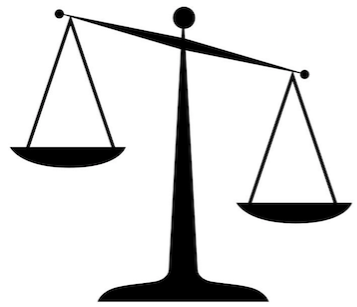

Je vuile was
============

Wie doet je was?

Ik zal je even uitleggen hoe je je was moet doen. Je begint met het vullen van de wasmachine. Daarna doe je wasmiddel en wasverzachter in de juiste vakjes. Je kiest het programma en schakelt de machine in. Hé, dat is grappig, er gaan lampjes branden. Kennelijk is de stroom nu ingeschakeld. Nog beter, nu wordt de wasmachine ook nog gevuld met water. Helemaal aan het einde van de wasbeurt wordt het vieze water afgepompt. Na ruim een uur geeft de wasmachine aan dat deze klaar is. Nu kan je de machine uitschakelen en de schone was er uit halen.

1.  Wie voorziet in stroom, water, en de afvoer van het afvalwater?

2.  Teken het SSD.

Wat gebeurt er eigenlijk nadat je de wasmachine hebt ingeschakeld?

In de wasmachine zit een centrale aanstuureenheid, of aansturing in het kort. Nadat je ingeschakeld hebt opent de aansturing het waterventiel waarna de wasmachine vol stroomt. Eenmaal gevuld, wordt het verwarmingselement ingeschakeld om de temperatuur naar 40 graden te brengen. Daarna wordt het ventiel weer gesloten. (Je hebt gelijk, het is een beetje een vreemde machine, die het water op temperatuur heeft voordat het ventiel wordt gesloten.) Daarna wordt de motor ingeschakeld om de trommel te laten draaien. Wanneer de was schoon is, wordt het water afgepomt (je ziet het, het is echt een beetje een vreemde machine). Tot slot wordt tegelijktijdig gecentrifugeerd en afgepompt. Daarna geeft de aansturing aan dat de was klaar is.

1.  Teken het sequentiediagram van deze (vreemde?) machine.

    Je kan gelijktijdige processen met een *par* frame aangeveven.

2.  Maak tot slot het klassendiagram voor deze machine.

3.  Controleer je producten aan de hand van de criteria die jullie vorige week hebben opgesteld.

    Controleer je criteria aan de hand van de opgestelde producten.

Acht Munten
===========

Op tafel staan drie schaaltjes en een ouderwetse weegschaal zoals op bijgaande plaatje:

In een van de schaaltjes liggen acht munten waarvan er één vals is: deze is te licht.

Het is de bedoeling dat je met behulp van de weegschaal de valse munt in zo weinig mogelijk wegingen vindt. Echte munten gaan in het ene lege bakje, de ene valse munt moet in het andere bakje terecht komen.

1.  Maak een domeinmodel.

2.  Maak een sequentiediagram met de oplossing voor de meest efficiente methode om de munt te vinden.

3.  Controleer weer wederzijds producten en criteria.

Drie Kannen
===========

Op tafel staan drie kannen, de eerste kan heeft in inhoud van acht liter en is gevuld met water. De beide andere kannen hebben een inhoud van vijf en drie liter en zijn (nog) leeg.

Je mag de inhoud van een kan overschenken in een andere kan. Voorwaarde is dat je óf een kan helemaal leeg schenkt óf de andere kan helemaal vult.

Het is de bedoeling om zo te schenken dat je al het water in de kannen houdt en dat er uiteindelijk één kan is met precies vier liter water.

1.  Maak het domeinmodel.

2.  Maak het sequentiediagram die de oplossing geeft voor dit probleem.

Dat was een hele klus om een goede oplossing te vinden.

1.  Bedenk een (brute) methode waarmee je je laptop het zware werk kan doen.

    Ga na of je daarvoor een aanpassing van het domeinmodel nodig hebt, voer deze zonodig door en leg je methode uit aan de hand van een sequentiediagram.

2.  Controleer weer wederzijds producten en criteria.

